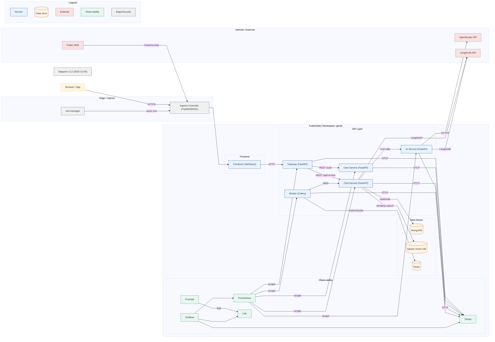
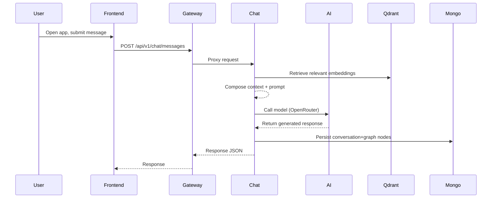

# GenAI Med Chat — Architecture Guide

## 1. System Architecture Overview

### 1.1 High-Level Diagram


### 1.2 Components and Interactions
- Frontend: Vite/React monorepo under `frontend`, provides UI, talks to `Gateway` over HTTP.
- Gateway: FastAPI reverse proxy and BFF. Proxies `auth`, `users`, and `chat` endpoints to services. See `backend/app/gateway/gateway/main.py:32-66` for proxy routes and `backend/app/gateway/gateway/main.py:44-46` for `/ping`.
- User Service: FastAPI service for authentication and user management. Has `/auth` APIs and a health endpoint; see `backend/app/services/user_service/user_service/main.py:23-34`.
- Chat Service: FastAPI service orchestrating RAG/LLM calls, stores conversations in MongoDB and embeddings in Qdrant; exposes `api/v1/chat` routes and uses LangGraph when available. See `backend/app/services/chat_service/chat_service/services/chat_service.py:39-71` for retrieval logic.
- AI Service: FastAPI service calling external LLMs (OpenRouter). Receives prompts from Chat Service.
- Worker: Celery worker for asynchronous jobs (OCR/voice/ingestion), using Redis for broker/results; see `backend/worker/Dockerfile` for runtime.
- Databases: `mongo` for documents and conversation graph, `qdrant` for vector retrieval, `redis` for queues and cache.
- Observability: Prometheus scraping, Loki for logs via Promtail, Tempo for traces, Grafana dashboards/datasources. Kubernetes templates in `infra/K3s/charts/genai/templates/observability/*`.
- Ingress: HTTP routing to services; class configurable via Helm values. See `infra/K3s/charts/genai/templates/ingress.yaml:2-29`.
- Autoscaling: HPAs for `gateway`, `chat-service`, and `ai-service`. See `infra/K3s/charts/genai/templates/hpa.yaml:1-59`.
- Persistent Volumes: PVCs for MongoDB and Qdrant state. See `infra/K3s/charts/genai/templates/storage.yaml:1-29`.

### 1.3 Data Flow



## 2. Execution Instructions

### 2.1 Prerequisites
- Local (Docker Compose): Docker Desktop, `docker compose`, ports available (`8000, 8001, 8003, 8004, 5173, 3100, 3200, 9092, 3001`).
- Kubernetes (k3s): `kubectl`, `helm`, a running k3s cluster, optional Ingress controller (`traefik` default in k3s or `nginx-ingress`).
- DNS or `/etc/hosts` entries for `*.genai.local` if using Ingress hosts.

### 2.2 Local Development (Docker Compose)
- Navigate and start:
```bash
cd infra/local
docker compose up -d
```
- Tail logs:
```bash
docker compose logs -f gateway
```
- Important service ports:
  - `gateway`: `8000`, `user_service`: `8001`, `chat_service`: `8003`, `ai_service`: `8004`, `frontend`: `5173`.
  - Observability: `grafana`: `3001`, `prometheus`: `9092`, `loki`: `3100`, `tempo`: `3200`.
- Environment file for AI secrets is mounted from `infra/env/.env` (see `infra/local/docker-compose.yml:161-175`). Define keys such as `OPENROUTER_API_KEY`, `LANGSMITH_API_KEY`, `SECRET_KEY`.

### 2.3 Kubernetes (k3s) Deployment via Helm
- Helm chart location: `infra/K3s/charts/genai` with values in `values.yaml` and environment-specific overrides in `values-k3s.yaml`.
- Install/upgrade:
```bash
# From repository root
helm upgrade --install genai infra/K3s/charts/genai \
  -n genai \
  --create-namespace \
  -f infra/K3s/charts/genai/values-k3s.yaml \
  --set secrets.OPENROUTER_API_KEY="<your-key>" \
  --set secrets.SECRET_KEY="<your-secret>" \
  --set secrets.LANGSMITH_API_KEY="<your-key>"
```
- Ingress controller:
  - The chart defaults to `ingress.className: nginx` (`infra/K3s/charts/genai/values.yaml:58-76`). On k3s, set to `traefik` to use the built-in controller:
```bash
helm upgrade --install genai infra/K3s/charts/genai -n genai \
  -f infra/K3s/charts/genai/values-k3s.yaml \
  --set ingress.className=traefik
```
- TLS:
  - If `ingress.tls.enabled: true`, ensure `secretName: genai-tls` exists, or disable TLS for local dev:
```bash
helm upgrade --install genai infra/K3s/charts/genai -n genai \
  --set ingress.tls.enabled=false
```
- Observability toggle:
```bash
helm upgrade --install genai infra/K3s/charts/genai -n genai \
  --set observability.enabled=true
```

### 2.4 Configuration and Environment Variables
- ConfigMap keys populated from `values.yaml` via `genai-config` (`infra/K3s/charts/genai/templates/configmap.yaml:6-20`):
  - `CHAT_SERVICE_URL`, `USER_SERVICE_URL`, `MONGO_URI`, `MONGO_DB`, `QDRANT_URL`, `AI_SERVICE_URL`, `OPENROUTER_API_BASE_URL`, OTEL keys, and LangSmith keys.
- Secret keys via `genai-secrets` (`infra/K3s/charts/genai/templates/secrets.yaml:7-10`):
  - `OPENROUTER_API_KEY`, `SECRET_KEY`, `LANGSMITH_API_KEY`.
- Service pods consume these via `env` in deployments (e.g., `gateway` at `infra/K3s/charts/genai/templates/gateway.yaml:24-71`, `chat` at `infra/K3s/charts/genai/templates/chat.yaml:24-81`, `ai` at `infra/K3s/charts/genai/templates/ai.yaml:24-71`, `user` at `infra/K3s/charts/genai/templates/user.yaml:24-76`).

### 2.5 Common Setup Issues and Troubleshooting
- Ingress class mismatch: If routes 404, ensure `ingress.className` matches installed controller (`traefik` for k3s default, `nginx` if you installed NGINX Ingress).
- TLS secret missing: Disable TLS or create `genai-tls` before applying chart.
- Missing secrets: Set required secrets with `--set secrets...` or edit `values.yaml`.
- Ports occupied: Adjust local `docker-compose` published ports if conflicts occur.
- Resource limits: HPAs reference CPU utilization; ensure node resources are sufficient, or tune `replicas` and resource `requests/limits`.
- DNS: Add `/etc/hosts` entries for `app.genai.local`, `api.genai.local`, `chat.genai.local`, `ai.genai.local`, `user.genai.local`, `grafana.genai.local`, `prometheus.genai.local`, `tempo.genai.local`.


## 3. Post-Execution Information

### 3.1 Expected Behavior
- All deployments become `Ready`; services respond on configured ports; Ingress hosts route to backing services.
- Frontend serves the app; Gateway proxies `auth`, `users`, and `chat` requests; Chat interacts with AI, Mongo, and Qdrant; Worker processes background tasks.

### 3.2 Verifying Health
- Kubernetes:
```bash
kubectl -n genai get pods,svc,ingress
kubectl -n genai logs deploy/gateway -f
kubectl -n genai logs deploy/chat-service -f
```
- Ping endpoints:
```bash
# Gateway
curl -s http://api.genai.local/ping
# User Service
curl -s http://user.genai.local/ping
```
  - See `backend/app/gateway/gateway/main.py:44-46` and `backend/app/services/user_service/user_service/main.py:23-34`.
- Local (Docker):
```bash
docker compose ps
docker compose logs -f chat_service
curl -s http://localhost:8000/ping
```

### 3.3 Monitoring and Logging
- Grafana: `http://grafana.genai.local` (k8s) or `http://localhost:3001` (Docker). Datasources provisioned for Prometheus, Loki, Tempo (`infra/K3s/charts/genai/templates/observability/grafana.yaml:8-24`).
- Prometheus: `http://prometheus.genai.local` or `http://localhost:9092`.
- Tempo (Tracing): `http://tempo.genai.local` or `http://localhost:3200`; OTLP endpoints configured via `values.yaml`.
- Loki (Logs) with Promtail shipping container logs.
- Collect recent logs in k8s:
```bash
cd infra/scripts
bash collect_logs.sh
```
  - See `infra/scripts/collect_logs.sh:4-10`.


## 4. Containerization Details

### 4.1 Role of Containers
- Encapsulate services (Gateway, User, Chat, AI, Worker) and infrastructure (Mongo, Qdrant, Redis, Observability) with reproducible environments.

### 4.2 Orchestration
- Local: Docker Compose (`infra/local/docker-compose.yml`) wires services, networks, volumes, and observability.
- Kubernetes (k3s): Helm chart defines Deployments, Services, StatefulSets, PVCs, Ingress, HPAs under `infra/K3s/charts/genai/templates/*`.

### 4.3 Best Practices
- Pin image tags (`values.yaml:3-12`) instead of `latest` in production.
- Define `resources.requests/limits` and probes (already present in templates).
- Use ConfigMaps and Secrets for configuration; never hardcode credentials.
- Use StatefulSets + PVCs for stateful components (Mongo/Qdrant).
- Enable autoscaling with HPAs based on CPU/memory as appropriate.


## 5. k3s and Traefik Components

### 5.1 k3s Implementation
- Lightweight Kubernetes used as the target environment. Namespace created via `infra/K3s/charts/genai/templates/namespace.yaml`.
- Services are exposed internally via ClusterIP and externally via Ingress rules defined in `infra/K3s/charts/genai/templates/ingress.yaml` with hosts in `values.yaml:75-106`.

### 5.2 Traefik ("Tarief") Purpose and Functionality
- k3s ships Traefik as the default Ingress controller.
- If you use Traefik, set `ingress.className=traefik` and apply host rules; Traefik will route traffic from `*.genai.local` to Services defined in the chart.
- Alternatively, you can deploy NGINX Ingress and set `ingress.className=nginx` (current default in `values.yaml`).

### 5.3 Configuration Specifics
- Ingress:
```yaml
# infra/K3s/charts/genai/values.yaml
ingress:
  enabled: true
  className: traefik  # use traefik in k3s, or nginx if installed
  tls:
    enabled: false    # set true if you provision tls secret
  hosts:
    - host: app.genai.local
      service: frontend
      port: 80
    - host: api.genai.local
      service: gateway
      port: 8000
    # ... other hosts for chat, ai, user, grafana, prometheus, tempo
```
- Observability images and credentials in `values.yaml:116-128`.
- Storage class can be set via `storage.storageClassName` (empty by default) and sizes via `storage.mongo.size` and `storage.qdrant.size`.

### 5.4 Interaction Patterns
- Traefik/Ingress terminates HTTP(S), applies host/path rules, forwards to ClusterIP Services.
- Services discover each other via internal DNS (`gateway` calls `chat-service`, `user-service`, etc.).
- Observability components receive telemetry via OTLP (Tempo), scrape via Prometheus, and aggregate logs via Promtail->Loki.


## Appendix: Quick References

- Helm chart values: `infra/K3s/charts/genai/values.yaml`.
- Deployments/Services:
  - Gateway: `infra/K3s/charts/genai/templates/gateway.yaml`
  - Frontend: `infra/K3s/charts/genai/templates/frontend.yaml`
  - Chat: `infra/K3s/charts/genai/templates/chat.yaml`
  - AI: `infra/K3s/charts/genai/templates/ai.yaml`
  - User: `infra/K3s/charts/genai/templates/user.yaml`
  - Redis: `infra/K3s/charts/genai/templates/redis.yaml`
  - Mongo: `infra/K3s/charts/genai/templates/mongo.yaml`
  - Qdrant: `infra/K3s/charts/genai/templates/qdrant.yaml`
- Ingress: `infra/K3s/charts/genai/templates/ingress.yaml`
- HPAs: `infra/K3s/charts/genai/templates/hpa.yaml`
- Config/Secrets:
  - ConfigMap: `infra/K3s/charts/genai/templates/configmap.yaml`
  - Secrets: `infra/K3s/charts/genai/templates/secrets.yaml`
- Observability: `infra/K3s/charts/genai/templates/observability/*`

## Deployment Customization Guide

### 1. Hostname Configuration
- Production hostnames (recommended):
  - Frontend: `app.genai.example.com`
  - API Gateway: `api.genai.example.com`
  - Chat Service: `chat.genai.example.com`
  - AI Service: `ai.genai.example.com`
  - User Service: `user.genai.example.com`
  - Observability: `grafana.genai.example.com`, `prometheus.genai.example.com`, `tempo.genai.example.com`
- Staging/development hostnames:
  - Use subdomains or separate root: `app.stg.genai.example.com`, `api.dev.genai.example.com`
  - Alternatively, local dev via `/etc/hosts`: `*.genai.local` mapped to Ingress IP.
- DNS configuration:
  - Create `A/AAAA` records pointing to your Ingress LoadBalancer IP (or external LB).
  - For wildcard routing, set `*.genai.example.com` CNAME to the primary domain.
  - Recommended TTL: `300s` for agility during migrations.

Environment values template:
```yaml
# values.prod.yaml (excerpt)
ingress:
  enabled: true
  className: traefik
  tls:
    enabled: true
    secretName: genai-tls
  hosts:
    - host: app.genai.example.com
      service: frontend
      port: 80
    - host: api.genai.example.com
      service: gateway
      port: 8000
    - host: chat.genai.example.com
      service: chat-service
      port: 8003
    - host: ai.genai.example.com
      service: ai-service
      port: 8004
    - host: user.genai.example.com
      service: user-service
      port: 8001
```

### 2. TLS/SSL Setup
- Certificate authority:
  - Prefer Let's Encrypt via `cert-manager` for automation.
  - Commercial CA for enterprise requirements (import certs into Kubernetes as secrets).
- Management approach:
  - Automated renewal using `cert-manager` `Issuer`/`ClusterIssuer` with `HTTP-01` or `DNS-01`.
  - For private environments, use internal CA and automate via ACME-compatible service.
- Security requirements:
  - Enable TLS 1.2+ (prefer 1.3 where supported).
  - Modern ciphers; disable weak suites; enable HSTS and SSL redirect at Ingress.

cert-manager example:
```yaml
# clusterissuer.yaml
apiVersion: cert-manager.io/v1
kind: ClusterIssuer
metadata:
  name: letsencrypt
spec:
  acme:
    email: devops@genai.example.com
    server: https://acme-v02.api.letsencrypt.org/directory
    privateKeySecretRef:
      name: acme-account-key
    solvers:
      - http01:
          ingress:
            class: traefik
```
Apply and reference `secretName` in `values.yaml` (`genai-tls`).

### 3. CI/CD Pipeline Details
- Platform:
  - GitHub Actions (recommended) or GitLab CI/Jenkins based on organization standards.
- Workflow overview:
  - Build and test frontend and backend.
  - Build and push Docker images to registry (e.g., GHCR).
  - Deploy to k3s via Helm with environment-specific values.
- Promotion strategy:
  - `dev`: pushes on `main` branch.
  - `staging`: release-candidate branch with manual approval.
  - `prod`: tagged releases with change control.
- Automated testing:
  - Backend: `pytest`, lint/type-check with `ruff`/`mypy` if configured.
  - Frontend: `jest` unit tests; CI ensures `lerna run build` succeeds.
  - Container scanning: `trivy` on images; SAST tools as applicable.

GitHub Actions example:
```yaml
# .github/workflows/deploy.yaml
name: deploy
on:
  push:
    branches: ["main"]
jobs:
  build-and-deploy:
    runs-on: ubuntu-latest
    steps:
      - uses: actions/checkout@v4
      - name: Set up Node
        uses: actions/setup-node@v4
        with: { node-version: '20' }
      - name: Frontend build
        run: |
          cd frontend
          npm ci
          npm --workspace packages/app run build
      - name: Set up Python
        uses: actions/setup-python@v5
        with: { python-version: '3.12' }
      - name: Backend tests
        run: |
          cd backend/app
          make install
          # add pytest if available
      - name: Build images
        run: |
          docker build -t ghcr.io/org/gateway:latest -f backend/app/gateway/Dockerfile .
          docker build -t ghcr.io/org/chat-service:latest -f backend/app/services/chat_service/Dockerfile .
          docker build -t ghcr.io/org/ai-service:latest -f backend/app/services/ai_service/Dockerfile .
          docker build -t ghcr.io/org/user-service:latest -f backend/app/services/user_service/Dockerfile .
      - name: Login to GHCR
        uses: docker/login-action@v3
        with:
          registry: ghcr.io
          username: ${{ github.actor }}
          password: ${{ secrets.GITHUB_TOKEN }}
      - name: Push images
        run: |
          docker push ghcr.io/org/gateway:latest
          docker push ghcr.io/org/chat-service:latest
          docker push ghcr.io/org/ai-service:latest
          docker push ghcr.io/org/user-service:latest
      - name: Helm deploy
        uses: azure/k8s-deploy@v4
        with:
          manifests: |
            infra/K3s/charts/genai/templates
          images: |
            ghcr.io/org/gateway:latest
            ghcr.io/org/chat-service:latest
            ghcr.io/org/ai-service:latest
            ghcr.io/org/user-service:latest
          namespace: genai
          strategy: none
```

### 4. Packaging Specifications
- Frontend (Vite):
  - Toolchain: Vite with React; `packages/app` builds with `npm --workspace packages/app run build`.
  - Optimization: Code splitting, asset hashing, gzip/brotli compress; leverage CDN for static assets if needed.
  - Containerization: Build stage creates static assets; serve via lightweight static server (e.g., `nginx`) in production.
  - Static serving: Configure Ingress to route `app.*` host to `frontend` Service on port `80`.
- Backend (Python FastAPI):
  - Runtime: Python 3.12 `slim`; dependencies via `uv` workspaces.
  - Containerization: Multi-stage Dockerfiles already present for Gateway/Chat/User/AI; keep images minimal.
  - Service discovery: Kubernetes DNS (service names) and env vars via ConfigMaps/Secrets.
  - Config management: Twelve-factor via env; no baked secrets.

### 5. Integration Requirements
- Protocols:
  - HTTP/JSON between frontend and `Gateway`; `Gateway` proxies to services.
- Authentication/authorization:
  - JWT issued by User Service; Gateway forwards auth context.
  - Password hashing via `passlib`; token generation in `user_service/core/security.py`.
- CORS:
  - Configure allowed origins via `shared.config.settings.CORS_ORIGINS` for each environment.
- Service-to-service security:
  - Use `NetworkPolicy` to restrict inter-service traffic.
  - Consider mTLS via service mesh (Istio/Linkerd) for production.
  - Secrets via Kubernetes Secrets; RBAC/namespace isolation.

### 6. Step-by-Step Implementation
- Dev:
  - `docker compose up -d` in `infra/local`.
  - Set `infra/env/.env` for AI keys.
- Staging/Prod:
  - Configure DNS and cert-manager; create `ClusterIssuer`.
  - Prepare `values.<env>.yaml` with hostnames, TLS, images.
  - `helm upgrade --install` with the environment values file.

### 7. Verification Procedures
- Pods/services/ingress statuses:
```bash
kubectl -n genai get pods,svc,ingress
```
- Health checks:
```bash
curl -s https://api.genai.example.com/ping
curl -s https://user.genai.example.com/ping
```
- Observability:
  - Grafana dashboards for traces/logs/metrics; verify Prometheus targets and Tempo traces.

### 8. Troubleshooting Guidelines
- 404 at Ingress: check `ingress.className`, host rules, TLS termination.
- TLS issues: validate `ClusterIssuer`, challenge type, DNS/HTTP reachability.
- Image pulls: ensure registry credentials and image tags.
- Storage Pending: set `storage.storageClassName` to a valid class in cluster.
- AI failures: set `OPENROUTER_API_KEY` and endpoints; confirm network egress.
- Qdrant/Mongo connectivity: verify Services and PVCs.

### 9. Security Best Practices
- Secrets management: use Kubernetes Secrets and external secret stores where possible.
- Least privilege: RBAC, namespace isolation, scoped service accounts.
- Network policies: restrict east-west traffic; ingress rate limiting/WAF.
- Image hygiene: pin versions, scan with `trivy`, regular updates.
- CORS: restrict to trusted origins; enforce HTTPS; HSTS.
