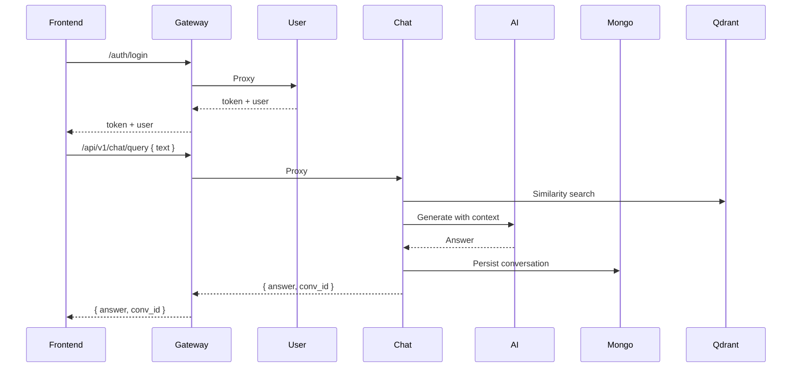

# GenAI Med Chat — Development Guide

## 1. Frontend Architecture

### Overview
- Monorepo managed by `lerna` with workspaces under `frontend/packages/*`.
- Primary app workspace: `packages/app`; shared UI, utilities, and store in sibling workspaces.

### Files and Roles
- `frontend/package.json`: Monorepo scripts (`setup`, `build`, `dev`, `test`, `clean`), dev deps (`vite`, `lerna`, `jest`).
- `frontend/lerna.json`: Lerna config and versioning baseline.
- `frontend/Dockerfile`: Multi-stage for dev/build. Dev target runs `npm --workspace packages/app run dev` with `VITE_API_BASE_URL` support.
- `frontend/jest.config.js`, `babel.config.js`: Testing config.
- `frontend/.gitignore`, `.dockerignore`, `clean_frontend.sh`, `run_frontend.sh`: housekeeping.

#### `packages/app`
- `src/main.jsx`: Entrypoint mounting React root with Redux `Provider` and store from `@genai-med-chat/store` (frontend/packages/app/src/main.jsx:8-14).
- `src/App.jsx`: Top-level authenticated shell:
  - Wraps content in `AuthProvider` from `@genai-med-chat/auth` (frontend/packages/app/src/App.jsx:7-11).
  - If unauthenticated, shows `LoginForm`/`RegisterForm`; if authenticated, renders `Chat` and passes `logout` (frontend/packages/app/src/App.jsx:36-104).
  - Animations via `gsap` on initial mount (frontend/packages/app/src/App.jsx:20-34).
- `index.html`, `index.css`: Vite HTML host and global styles.
- `package.json`, `vite.config.js`, `tailwind.config.js`, `postcss.config.{js,cjs}`: build and styling.

#### `packages/auth`
- `src/components/LoginForm.jsx`: Login UI using shared components (`Button`, `Input`, `Card`, `ErrorMessage`) with `gsap` animation and callbacks to `onLogin` (frontend/packages/auth/src/components/LoginForm.jsx:42-95).
- `src/components/RegisterForm.jsx`: Registration UI (not shown, analogous to login).
- `src/context/AuthProvider.jsx`: Context provider exposing `useAuth`, `login`, `register`, `logout` semantics; wraps children (imported by `App.jsx`).
- `index.js`: Re-exports components/context for consumption.

#### `packages/chat`
- `src/components/Chat.jsx`: Main chat container orchestrating:
  - Redux state selectors (`messages`, `loading`, `lastConvId`, `graph`, `auth.user`) (frontend/packages/chat/src/components/Chat.jsx:13-18).
  - User input, voice recording, OCR file upload, and graph visualization (frontend/packages/chat/src/components/Chat.jsx:34-105).
  - Dispatches `addMessage`, `sendChatQuery`, `fetchGraph` actions from store (frontend/packages/chat/src/components/Chat.jsx:36-44, 39-45, 100-104).
  - Composition with subcomponents: `Sidebar`, `MessageList`, `Composer`, `GraphModal`, `Appointments`, `Profile` (frontend/packages/chat/src/components/Chat.jsx:5-10).
- Additional subcomponents implement UI regions and modals.

#### `packages/shared`
- `src/components/*`: Reusable UI: `Button`, `Card`, `ErrorMessage`, `Input`, `LoadingSpinner`.
- `src/utils/api.js`:
  - `API_BASE_URL` from `import.meta.env.VITE_API_BASE_URL` defaulting to `http://localhost:8000` (frontend/packages/shared/src/utils/api.js:1).
  - `apiClient` implements `get`, `post`, `put`, `delete` attaching `Authorization: Bearer <token>` (frontend/packages/shared/src/utils/api.js:12-58).
  - `postForm` for `FormData` uploads (voice/ocr) (frontend/packages/shared/src/utils/api.js:60-69).
  - `handleResponse` returns JSON or throws error (frontend/packages/shared/src/utils/api.js:71-77).
- `src/utils/storage.js`, `validation.js`: Local storage helpers and validation.
- `index.js`: Re-exports shared artifacts.

#### `packages/store`
- `src/app/store.js`: Configures Redux Toolkit store with `auth` and `chat` reducers (frontend/packages/store/src/app/store.js:5-10).
- `src/features/authSlice.js`:
  - Async thunks: `fetchMe`, `loginUser`, `registerUser` calling `/auth/*` (frontend/packages/store/src/features/authSlice.js:4-30).
  - Persists token via shared storage utils and exposes `logout` reducer (frontend/packages/store/src/features/authSlice.js:40-44, 59-60).
- `src/features/chatSlice.js`:
  - Async thunks: `sendChatQuery` → `/api/v1/chat/query`, `fetchGraph` → `/api/v1/graph/{conv_id}` (frontend/packages/store/src/features/chatSlice.js:5-24).
  - Chat state: `messages`, `lastConvId`, `graph`, loading/error; reducers for `addMessage` and `clearChat` (frontend/packages/store/src/features/chatSlice.js:26-46, 64-65).

### State Management
- Redux Toolkit with slices per feature, composed via `configureStore`.
- Auth context (`AuthProvider`) complements store for auth flows; UI reads from both.

### Routing
- The app uses a shell pattern instead of router; `active` tab state drives conditional rendering (`interview`, `appointments`, `profile`). Vite supports SPA entry; adding `react-router` is straightforward if needed.

### Styling
- TailwindCSS and PostCSS with custom classes; shared components encapsulate UI primitives.
- GSAP for micro-animations.


## 2. Backend Architecture

### Overview
- Python microservices with FastAPI, structured into workspaces (`backend/app`) and supporting worker (`backend/worker`).
- Observability integrated via OpenTelemetry (traces) and structured logs.

### Files and Roles
- `backend/app/pyproject.toml`: Workspace config listing packages.
- `backend/app/Makefile`: Dev commands using `uv` to run services (backend/app/Makefile:15-27).

#### Gateway (`backend/app/gateway`)
- `gateway/main.py`:
  - FastAPI app with CORS and observability (backend/app/gateway/gateway/main.py:9-13, 77-83).
  - Proxy endpoints:
    - `/auth/*` → User Service (backend/app/gateway/gateway/main.py:32-36)
    - `/users/*` → User Service (backend/app/gateway/gateway/main.py:38-41)
    - `/chat/*` and `/api/v1/chat/*` → Chat Service (backend/app/gateway/gateway/main.py:49-58)
    - `/api/v1/graph/*`, `/api/v1/voice`, `/api/v1/ocr` → Chat Service passthrough (backend/app/gateway/gateway/main.py:61-76)
  - Health: `/ping` (backend/app/gateway/gateway/main.py:44-46).
- `shared/*` in gateway: common config/logger/tracing modules duplicated across services.
- `Dockerfile`: Multi-stage image build using `uv` workspaces.

#### Chat Service (`backend/app/services/chat_service`)
- `chat_service/main.py`:
  - FastAPI app with routers: `chat`, `ingest`, `voice`, `ocr`, `graph`; CORS+observability (backend/app/services/chat_service/chat_service/main.py:9-24).
- `api/v1/chat.py`:
  - `POST /query` protected by `get_current_user`; delegates to `ChatService.handle_query` (backend/app/services/chat_service/chat_service/api/v1/chat.py:22-27).
- `api/v1/voice.py`, `api/v1/ocr.py`:
  - Proxy file uploads to AI Service (`/api/v1/voice`, `/api/v1/ocr`) (backend/app/services/chat_service/chat_service/api/v1/voice.py:19-23, backend/app/services/chat_service/chat_service/api/v1/ocr.py:21-25).
- `api/v1/graph.py`:
  - `GET /graph/{conv_id}` returns conversation graph from `LangGraphService` (backend/app/services/chat_service/chat_service/api/v1/graph.py:8-14).
- `services/chat_service.py`:
  - Core business logic for handling queries, RAG retrieval to Qdrant, conversation persistence in Mongo, graph node logging (see retrieval and node recording around backend/app/services/chat_service/chat_service/services/chat_service.py:39-71).
- `services/ingest_service.py`, `services/langgraph_service.py`: Ingestion and graph persistence helpers.
- `shared/*` in chat_service: common modules.
- `tests/test_chat_api.py`: Unit tests for chat API.
- `Dockerfile`: Multi-stage build using `uv`.

#### AI Service (`backend/app/services/ai_service`)
- `ai_service/main.py`:
  - Endpoints: `POST /api/v1/generate`, `/ocr`, `/voice`, `/embed` with OpenRouter calls and LangSmith tracing (backend/app/services/ai_service/ai_service/main.py:34-53, 59-72, 75-88, 91-102).
  - Observability via OpenTelemetry; headers built from env.
- `Dockerfile` and shared modules.

#### User Service (`backend/app/services/user_service`)
- `user_service/main.py`: FastAPI app + observability + CORS; includes `auth` router and `/ping` (backend/app/services/user_service/user_service/main.py:8-22, 27-34).
- `api/auth.py`:
  - `POST /register`, `POST /login`, `GET /me`; JWT via `jose`, password hashing via `passlib`; Mongo persistence (backend/app/services/user_service/user_service/api/auth.py:46-79, 82-111).
- `core/security.py`: Token creation, hashing, verification.
- `schemas.py`: Pydantic models for user, token (backend/app/services/user_service/user_service/schemas.py:1-34).
- `Dockerfile` and `pyproject.toml`.

#### Worker (`backend/worker`)
- `celery_worker.py`:
  - Celery broker/backend via Redis; `long_ingest_task` streams files to Chat Service for ingestion (backend/worker/celery_worker.py:25-48).
- `Dockerfile`: Builds worker environment and telemetry packages.

#### Shared Modules (`backend/app/shared`)
- `config.py`: Service settings; Mongo/Qdrant, model config, AI service endpoints, CORS origins (backend/app/shared/config.py:16-34, 39-42).
- `logger.py`: OpenTelemetry tracing setup and structured logging (backend/app/shared/logger.py:5-26, 28-40).
- `mongo.py`, `mongo_repo.py`: Mongo connection and repository helpers.
- `tracing.py`: OpenTelemetry helper glue.


## 3. Integration Points

### Frontend ↔ Backend
- API base URL from `VITE_API_BASE_URL` resolves to Gateway (`/auth/*`, `/api/v1/*`).
- Auth: `@genai-med-chat/store` thunks call `/auth/login`, `/auth/register`, `/auth/me`; token stored in local storage and attached by `apiClient`.
- Chat: `sendChatQuery` posts to `/api/v1/chat/query`; `fetchGraph` grabs `/api/v1/graph/{conv_id}`.
- File uploads: `postForm` to `/api/v1/voice` and `/api/v1/ocr`.

### Contracts
- Authentication:
```json
POST /auth/login -> { token: string, user: { id, email, full_name, created_at } }
POST /auth/register -> { token, user }
GET /auth/me -> UserResponse
```
- Chat:
```json
POST /api/v1/chat/query -> { answer: string, sources?: [], conv_id?: string }
GET /api/v1/graph/{conv_id} -> { nodes: [], edges: [] }
```
- AI:
```json
POST /api/v1/generate -> { text: string, raw: object }
POST /api/v1/ocr -> { text: string }
POST /api/v1/voice -> { text: string }
```

### Data Flow Diagram


### Environment Configuration
- Frontend:
  - `VITE_API_BASE_URL` set to Gateway URL (`http://localhost:8000` in dev; ingress host in k8s).
- Backend:
  - `MONGO_URI`, `MONGO_DB`, `QDRANT_URL` for data stores.
  - `AI_SERVICE_URL`, `OPENROUTER_API_BASE_URL`, `OPENROUTER_API_KEY`.
  - Observability: `OTEL_EXPORTER_OTLP_ENDPOINT`, `OTEL_EXPORTER_OTLP_TRACES_ENDPOINT`, `OTEL_SERVICE_NAME`.

### Deployment Considerations
- Local: `infra/local/docker-compose.yml` brings up all services and observability.
- k3s: Helm chart under `infra/K3s/charts/genai` with `values.yaml` for images, resources, Ingress, secrets.


## 4. Development Guidelines

### Setup Instructions
- Frontend:
```bash
cd frontend
npm install
npm --workspace packages/app run dev
```
- Backend services:
```bash
cd backend/app
make install
make run-gateway
make run-user
make run-chat
make run-ai
```
- Worker:
```bash
cd backend/worker
# build and run via Dockerfile or run celery locally if configured
```

### Testing Strategy
- Frontend:
  - Unit tests with `jest` and React Testing Library; run via `npm test`.
- Backend:
  - Python tests (e.g., `chat_service/tests/test_chat_api.py`); add `pytest` suite for each service.
  - Consider contract tests between Gateway and services.

### Code Organization Principles
- Frontend:
  - Feature-based slices; shared components/utilities in `shared` workspace.
  - Keep API calls centralized in `shared/utils/api.js`.
- Backend:
  - Clear separation of API (`api/v1`), business logic (`services`), and shared infra (`shared`).
  - Minimal gateway; business logic lives in services.

### Performance Optimization
- Frontend:
  - Memoize heavy components, virtualize long lists, avoid unnecessary Redux updates.
  - Use Vite’s code splitting; optimize images/assets.
- Backend:
  - Tune Mongo/Qdrant indexes; batch operations where possible.
  - Use async HTTP clients and appropriate timeouts.

### Security Best Practices
- Frontend:
  - Avoid storing sensitive data beyond JWT; secure local storage usage.
  - Enforce strict CORS and HTTPS in production.
- Backend:
  - Hash passwords, sign JWTs with strong secrets; rotate keys.
  - Validate payloads (Pydantic), sanitize inputs; least-privilege DB credentials.
  - Use Kubernetes Secrets; restrict inter-service traffic with `NetworkPolicy`.

---
- This guide aligns with `infra/Architecture_Guide.md` and references concrete code locations for quick navigation.
